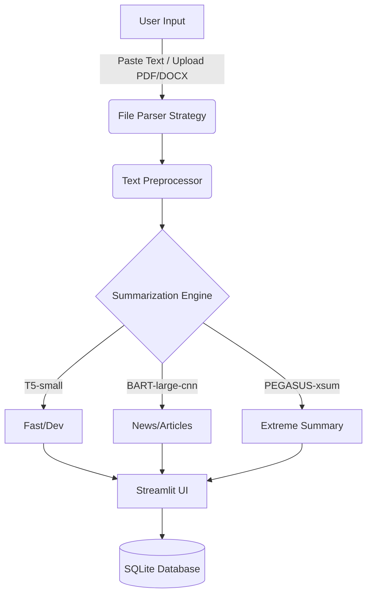

# AI Text Summarization System


A professional, production-quality AI Text Summarization System built from scratch. This application uses state-of-the-art Transformer models (BART, T5, PEGASUS) to extract, clean, and summarize text from various sources including PDFs, DOCX files, and plain text.

## 🌟 Features

- **Multi-Format Support**: Upload PDF, DOCX, or TXT files.
- **Multiple AI Models**: Choose between T5, BART-Large-CNN, and PEGASUS for different types of summarization (Extractive vs Abstractive).
- **Customizable Length**: Slider to select Short, Medium, or Long summaries.
- **Smart Analytics**: View original vs summary word count, compression ratio, and estimated reading time.
- **NLP Analysis**: TF-IDF keyword extraction and spaCy Named Entity Recognition (NER).
- **Local History**: SQLite database automatically saves your summary history.

## 🏗️ Architecture



## 🚀 Installation & Setup

1. **Clone the repository**
   ```bash
   git clone <your-repo-url>
   cd AI_Text_Summarizer
   ```

2. **Create a virtual environment**
   ```bash
   python -m venv venv
   # Windows
   .\venv\Scripts\activate
   # Mac/Linux
   source venv/bin/activate
   ```

3. **Install dependencies**
   ```bash
   pip install -r requirements.txt
   ```

4. **Run the application**
   ```bash
   streamlit run app.py
   ```

## 📂 Folder Structure

- `/app.py`: Main Streamlit application
- `/config.py`: Centralized configuration
- `/models/`: Transformer models, registry, and generation logic
- `/utils/`: File parsing, text preprocessing, keyword extraction, NER
- `/database/`: SQLite schema and manager
- `/ui/`: Custom CSS and layout components

## 🧠 NLP Concepts Implemented
- **Tokenization**: Subword tokenization (BPE)
- **Transformer Architecture**: Encoder-Decoder sequence-to-sequence modeling
- **Attention Mechanism**: Self-attention and cross-attention
- **Beam Search**: Exploring multiple paths for high-quality generation
- **TF-IDF**: Statistical keyword extraction
- **BIO Tagging**: Used in spaCy for Named Entity Recognition

## 📜 License
This project is licensed under the MIT License.
